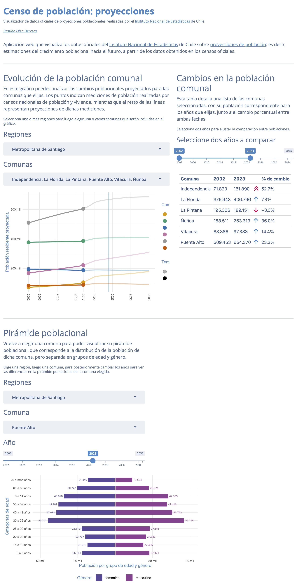

# Visualizador de proyecciones de población del Censo, Chile

[Aplicación web](https://bastianoleah.shinyapps.io/censo_proyecciones/) que visualiza los datos oficiales del [Instituto Nacional de Estadísticas](https://www.ine.gob.cl) de Chile sobre [proyecciones de población](https://www.ine.gob.cl/estadisticas/sociales/demografia-y-vitales/proyecciones-de-poblacion); es decir, estimaciones del crecimiento poblacional hacia el futuro, a partir de los datos obtenidos en los censos oficiales.

### Fuentes:
- INE, [Proyecciones de población](https://www.ine.gob.cl/estadisticas/sociales/demografia-y-vitales/proyecciones-de-poblacion)