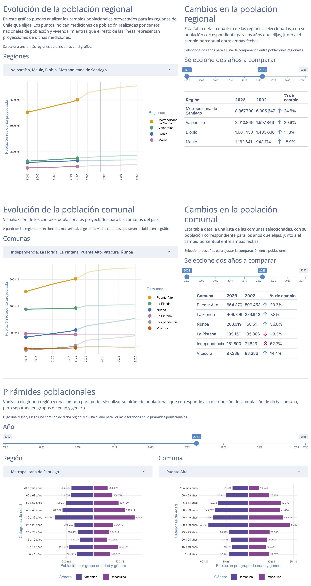

# Proyecciones de población del Censo

[Aplicación web](https://bastianoleah.shinyapps.io/censo_proyecciones/) que visualiza los datos oficiales del [Instituto Nacional de Estadísticas](https://www.ine.gob.cl) de Chile sobre [proyecciones de población](https://www.ine.gob.cl/estadisticas/sociales/demografia-y-vitales/proyecciones-de-poblacion); es decir, estimaciones del crecimiento poblacional hacia el futuro, a partir de los datos obtenidos en los censos oficiales.

El script `importar_poblacion_proyecciones.R` descarga directamente el archivo Excel con las proyecciones oficiales desde el INE, para usarlo en este proyecto.

## Datos
Descarga los datos de proyecciones de población por comuna y año, de 2002 a 2035, [en formato `.csv` en este enlace](https://github.com/bastianolea/censo_proyecciones_poblacion/raw/main/datos/datos_procesados/censo_proyecciones_año.csv).

En la carpeta `datos_procesados` se encuentran tablas de datos procesados en base a las proyecciones oficiales, incluyendo:

- `censo_proyecciones_año.csv`: (11 mil filas) proyecciones de población para todas las comunas del país, por año de proyección (de 2002 a 2035)
- `censo_proyecciones_año_edad_genero.parquet`: (1.9 millones de filas) proyecciones de población para todas las comunas del país, por edad y género, por año de proyección (de 2002 a 2035) 
- `censo_proyecciones_edad_prom.csv`: proyecciones de edad promedio, por comuna y año
- `censo_proyecciones_edad_menores.csv`: porcentaje de menores de edad (< 18), por comuna y año
- `censo_proyecciones_edad_adultomayor.csv`: porcentaje de adultos mayores (>= 60), por comuna y año
- `censo_proyeccion_2024.csv`: sólo la proyección para 2024 por comunas

## Fuentes:
- INE, [Proyecciones de población](https://www.ine.gob.cl/estadisticas/sociales/demografia-y-vitales/proyecciones-de-poblacion)